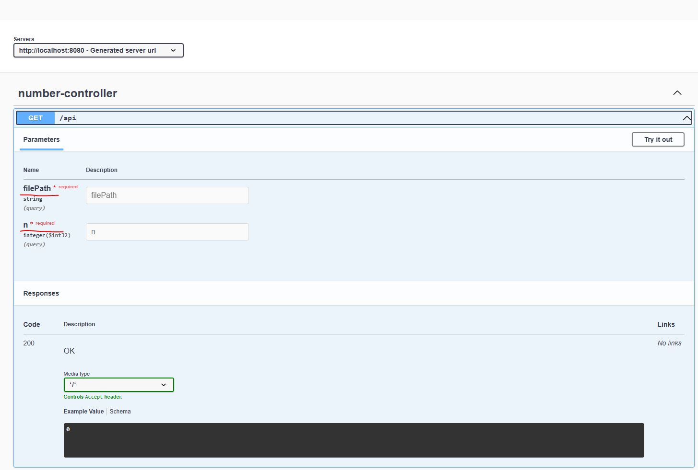

Приложение для нахождения N-ного максимального числа из файла xlsx.
Запуск приложения :
1. Скомпилируйте проект с помощью Maven:

   mvn clean install

2. Запустите приложение
3. Откройте Swagger UI в браузере по адресу: http://localhost:8080/swagger-ui.html

Тестирование :

1.Можно протестировать выполнения метода в интерфейсе Swagger

2.Можно протестировать метод, отправив GET-запрос на следующий URL:
http://localhost:8080/api?filePath=/path/to/your/file.xlsx&n=3
Замените /path/to/your/file.xlsx на путь к вашему файлу XLSX и n на желаемое значение.

3. Так же можно протестировать готовое приложение из командной строки OS Windows.
Готовый архив .jar лежит в корне проекта. Тестирование проводилось на jdk 21.

p.s. Тестовый файл так же в корне проекта numbers.xlsx
   
   
